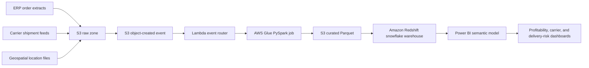

# SupplyFlow Architecture

SupplyFlow models a serverless AWS analytics platform for supply-chain profitability, carrier performance, and delivery-risk monitoring.

## Data Zones

- `raw`: Source-aligned CSV or JSON landing files from orders, shipments, carriers, customers, products, and locations.
- `warehouse`: Cleaned dimensions and enriched shipment facts written as partitioned Parquet for Redshift loading.
- `curated`: Local convenience outputs for quick inspection.
- `marts`: Business-ready aggregate tables for Power BI imports or DirectQuery.

## Warehouse Model

The Redshift model uses a nine-table snowflake schema:

- `fact_shipments`
- `dim_date`
- `dim_region`
- `dim_location`
- `dim_customer`
- `dim_product_category`
- `dim_product`
- `dim_carrier`
- `dim_service_level`

## Operational Behavior

1. Source systems land files into `s3://supplyflow-raw/raw/<entity>/`.
2. S3 object-created events invoke the Lambda router.
3. Lambda starts the Glue job and passes the source object metadata.
4. Glue reads raw files, standardizes dates and keys, calculates KPI fields, and writes the nine warehouse tables as Parquet.
5. Redshift loads curated facts and dimensions for dashboard consumption.
6. Power BI monitors margin, delivery risk, late shipments, and carrier reliability.

## Local Demo Outputs

Running `supplyflow-generate`, `supplyflow-curate`, and `supplyflow-validate` produces:

- `data/raw`: synthetic source extracts for orders, shipments, carriers, customers, products, and locations.
- `data/warehouse`: the nine-table snowflake schema modeled after Redshift.
- `data/marts`: dashboard-ready summaries for profitability, carrier performance, and delivery risk.
