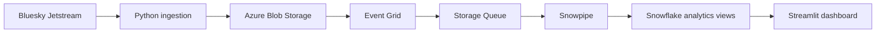

# TweetPulse

TweetPulse is a real-time social analytics pipeline that streams public Bluesky posts into Azure Blob Storage, loads them into Snowflake with Snowpipe, and displays KPIs, trends, topics, sentiment, and high-engagement posts in a Streamlit dashboard.

## Tech Stack

- Python
- Bluesky Jetstream
- Azure Blob Storage
- Azure Event Grid + Storage Queue
- Snowpipe + Snowflake
- Streamlit

## Architecture



## Project Structure

```text
tweetpulse/
├── src/tweetpulse/
│   ├── bluesky_stream.py      # Live Bluesky ingestion
│   ├── blob_storage.py        # Azure Blob upload helper
│   ├── dashboard.py           # Streamlit dashboard
│   ├── ingest_to_blob.py      # Local-to-Azure uploader
│   └── config.py              # Environment config
├── sql/                       # Snowflake setup scripts
├── data/blob/raw/             # Local JSONL batches
├── requirements.txt
└── README.md
```

## Setup

```bash
cd /Users/jennishachristinamartin/Desktop/tweetpulse
python3 -m venv .venv
source .venv/bin/activate
pip install -r requirements.txt
pip install -e .
```

Create a `.env` file from `.env.example` and fill in Azure/Snowflake values.

## Run Locally

Generate live Bluesky batches locally:

```bash
python -m tweetpulse.bluesky_stream --max-posts 500 --batch-size 100
```

Run the dashboard:

```bash
streamlit run src/tweetpulse/dashboard.py
```

## Social Audit Collection

Collect owned or public social-post data into normalized CSV and JSONL files:

```bash
python -m tweetpulse.social_audit_collectors --platform bluesky --max-posts 100
```

Search public Bluesky posts that mention Goods Unite Us:

```bash
python -m tweetpulse.social_audit_collectors --platform bluesky --bluesky-query "Goods Unite Us" --max-posts 100
```

Collect X posts through the official API:

```bash
export X_BEARER_TOKEN="..."
python -m tweetpulse.social_audit_collectors --platform x --x-username goodsuniteus --max-posts 100
```

Collect Instagram owned-account media insights through Meta Graph API:

```bash
export INSTAGRAM_USER_ID="..."
export INSTAGRAM_ACCESS_TOKEN="..."
python -m tweetpulse.social_audit_collectors --platform instagram --max-posts 100
```

Collect Threads owned-account post insights:

```bash
export THREADS_ACCESS_TOKEN="..."
python -m tweetpulse.social_audit_collectors --platform threads --max-posts 100
```

Outputs are written under:

```text
tweetpulse/data/social_audit/
```

The X, Instagram, and Threads collectors use official APIs/tokens. Use native platform exports as a fallback when metrics are unavailable through your current API permissions.

## Decodo Scraping

For public pages where scraping is permitted, use Decodo Web Scraping API. Set either a pre-encoded Decodo Basic token:

```bash
export DECODO_AUTH="..."
```

Or set username/password and the script will build the Basic header:

```bash
export DECODO_USERNAME="..."
export DECODO_PASSWORD="..."
```

Scrape one allowed public travel page:

```bash
PYTHONPATH=tweetpulse/src python3 -m tweetpulse.decodo_scraper \
  --url "https://example.com/travel-page" \
  --prefix travel_pages
```

Scrape several allowed public travel pages from a text file:

```bash
PYTHONPATH=tweetpulse/src python3 -m tweetpulse.decodo_scraper \
  --url-file tweetpulse/data/decodo/travel_urls.example.txt \
  --prefix travel_pages
```

The CSV includes extracted travel-friendly fields:

```text
title
meta_description
price_snippets
rating_snippets
date_snippets
travel_terms
visible_text_preview
```

Outputs are written under:

```text
tweetpulse/data/decodo/
```

Use Decodo for general web/travel pages only after checking the target site's terms. For X, Instagram, and Threads analytics, prefer native exports or official APIs.

## Run With Azure + Snowflake

Upload Bluesky batches to Azure Blob Storage:

```bash
python -m tweetpulse.bluesky_stream --max-posts 500 --batch-size 100 --upload-azure
```

Run the dashboard against Snowflake:

```bash
DASHBOARD_MODE=snowflake streamlit run src/tweetpulse/dashboard.py
```

## Dashboard Features

- Total posts, engagement, velocity, and positive sentiment KPIs
- Top topics by engagement
- Sentiment mix
- Tweet volume trend
- High-engagement post table
- Topics needing attention
- Functional date, topic, sentiment, source, and refresh controls

## Cost Note

Azure usage for this demo is low because it mainly uses Blob Storage, Event Grid, and Storage Queue. Snowflake credits are separate, so stop or suspend warehouses when not using the project.

## Cleanup

To avoid unnecessary charges:

- Stop local ingestion scripts.
- Suspend the Snowflake warehouse.
- Delete unused Azure resource groups when finished.
